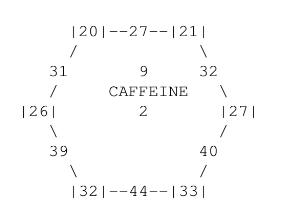

# 1. Overview

The core component of the system is built using the MVC architecture. The models act as a database, maintaining the state of the game. For example, the `Player` model maintains the player's victory points, number of resources, completed goals / criterions, etc. The models act as a data store for the views and controllers.

The `GameController` is the main controller that coordinates the flow of the game. It has a field `gameData` that provides a gateway to all the models. The `GameController` only queries for information from the models. It does not modify any data. The `GameController` delegates the responsibility of modifying the models to the `ManagerFacade` class.

Finally, the `GameView` class is responsible for most of the user interface. It displays information to the user, and relays user actions to the caller of its methods (the `GameView` methods are called by `ViewProxy` class. More on this later). The `GameController` gets the information that is relayed by the `View` classes, and acts accordingly.

# 2. Design

## 2.1. A Gateway to the Models

There are various sorts of information that is required to run the game. For example, what `Dice` a player has equipped, how many resources a player has, what `Criterions` and `Goals` are completed, etc. And the various `Manager` classes query and modify the states of the game- so they will need to access this information (along with the `GameController` of course).

More importantly, the **representation of the game may change**. For example, we could decide to add a new type of `Objective`, such as an `Elective`, or perhaps a new feature to add `Zombies` in the game. Manually adding new classes to represent these change would require a lot of changes to the `Manager` classes as they would need access to these new representations.

Hence we implemented a `ModelFacade` class that provides a gateway to all the models. It provides methods to access and modify the state of the game. This way, all `Manager` classes will have access to the same representation of the game while taking only a single dependency. Comparing this to manually adding new classes, this approach is more resilient to change since we do not need to modify the constructors that may look like this:

```cpp
ManagerClass::ManagerClass(std::vector<Player> players, std::vector<HexTile> hexTiles,
 std::vector<Criterion> criterions, std::vector<Goal> goals,
 std::vector<Elective> electives, std::vector<Zombie> zombies);
```
Rather, we pass a single argument to the constructor that contains the entire representation of the game:
```cpp
ManagerClass::ManagerClass(std::shared_ptr<ModelFacade> gameData);
```
This will enable all classes to access the same representation of the game while taking only a single dependency. For example, we wouldn't want to pass a copy of each `Model` class- this would mean changing a specific model will not be reflected in other instances of different classes which have their own copies of the `Model` classes. With this, constructing a new `Manager` (or any other class that will be required to accomodate new features) will be easier.

## 2.2. A Gateway to the Managers

While designing the system, we realized that the `GameController` class was doing too much work: it was responsible for orchestrating the game, calling the `View` classes' methods, and modifying the `Model` classes. This made the `GameController` class bulky and hard to maintain.

Hence we decided to move responsibilities of modifying the `Model` classes and game logic handling (such as whether a user can build a `Criterion` in a given location) to the `Manager` classes. However, we still had quite a few `Manager` classes each dealing with their own responsibilities- such as a `BoardManager` for handling logic related to the board, a `GameStateManager` for handling logic related to the game state (i.e saving / loading a game), and a `ResourceManager` for handling logic related to resources.

So instead of having a field for each `Manager` class in the `GameController` class, we created a `ManagerFacade` class that provides a gateway to all the `Manager` classes. This way, the `GameController` class can call the public methods of `ManagerFacade` without having to keep track of which `Manager` class to call for a particular task.

With this, the `GameController` class is only responsible for orchestrating the flow of the game. Responsibilities such as handling game logic and modifying the `Model` classes are delegated to the `Manager` classes. Meanwhile, the user interface is handled by the `View` classes, which the `GameController` calls when required.

## 2.3. Building the game

Initializing the game is a complex process. For example, the hex tiles need to know which objectives are adjacent to them; likewise, the objectives (i.e Criterions and Goals) need to know which tiles are adjacent to them. Moreover, for our implementation, we wanted to sort the `goals` and `criterions` vector within the `HexTile` class in a particular order. Consider the following tile:

<div align="center">
  

*Figure 1: An example HexTile*

</div>

We wanted to sort the `goals` and `criterions` so they follows a circular order present above. In the above example, the `Criterions` vector would be (in sorted order) `[20, 21, 27, 33, 32, 26]`- they naturally follow the circular order present in the image. We did this so it was easier to compute adjacent `Goals` and `Criterions`- which are vital functionalities for the game.

So it was clear that the representation of the game (i.e the `Models` classes) needed to be separete from the building process. So we made a separate `GameBuilder` class that was responsible for building the game.

`GameBuilder` abstracts the details of building the game's representation- such as sorting the objectives in a circular order for each `HexTile`. So the `GameStateManager` can call the public methods of `GameBuilder`, such as `buildPlayer(), buildBoard()`, without having to worry about the details. If a new developer does join our lovely team, this design will make it **harder for the new developer to make mistakes** since they cannot forget the smaller details of the game's representation- such as the circular sorting of the `Criterions` and `Goals` in the `HexTile` class. This will automatically be done when the `GameBuilder`'s `buildBoard()` is called.

## 2.4. Valid Input Handling

A large part of this assignment guranteed that the user will input valid values (though not all of it!). However, this may not be true in the future when more features are added to the game. We may want to ensure the user enters valid values in the case that they made a small type- **this would be useful for manual testing**.

In addition, we may add new types of `Objective` that enable the user to input a new value that was not previously possible. For example, we may add a new type of `Objective` that enables the user to input a new value that was not previously possible.

In this case, we wanted to add a robust, extensible system that can easily be modified to accomodate new, valid inputs. We implemented the **proxy pattern** with the `GameView` class to handle this. Specifically, we had a `ViewProxy` class that the `GameController` would call instead of the `GameView` class. The `ViewProxy` class would then call the appropriate methods of the `GameView` class.

The key distinction of the `Proxy` class is that it ensures valid input is entered. If an invalid input is entered, the `ViewProxy` class will either reprompt the user for the input or throw an errror (depending on how the `GameController` called its methods).

For now, the `ViewProxy` only checks that the input matches one of the expected values. For example, it checks if the input is a valid integer, or if the input is a valid `PlayerColor`, etc. It does not directly query the `Model` classes, nor does it use information provided by the `GameController`. This can easily be extended without modifying the logic of `GameView` which is solely responsible for dealing with I/O. Having a proxy class to handle input validation also makes the `GameController` class cleaner and more focused on orchestrating the game.

## 2.5. Separating Concerns with MVC

There are three main components while designing the system: the user interface, the game logic, and the representation of the current game state. These components screamed **MVC** to us.

Using the MVC architecture, we separated the concerns of each component. For example, the `View` classes were responsible for displaying the game state to the users (eg: printing the board, handling user input, etc). Only the `View` classes knew about the implementation details of how the game state is displayed to the user (such as printing the board in the hexagon shape). This allowed the `GameController` to focus on coordinating the game without having to worry about the details of how the game state is displayed to the user.

However, as we were designing the system, we knew that we were going to have multiple classes for each component. For example, we had multiple `View` classes- such as the `BoardView` for displaying the state of the game (such as the board), and the `GameView` for handling user input.

Now having the `GameController` directly manage these classes (i.e having a field for `BoardView` and `GameView`) would convolute the implementation of the `GameController` class.

Hence we created the `ViewProxy` class to act as a middleman between the `GameController` and the `View` classes. The `ViewProxy` class would then call the appropriate methods of the `View` classes. This "facade" reduced the number of fields in the `GameController` class- and enables extending the `View` classes without having to modify the `GameController` class.

Likewise, for the `Manager` classes (which were responsible for mutating / modifying the game state), we created the `ManagerFacade` class to act as a middleman between the `GameController` and the `Manager` classes. The `ManagerFacade` class would then call the appropriate methods of the concrete `Manager` classes. This "facade" reduced the number of fields in the `GameController` class- and enables extending the `Manager` classes without having to modify the `GameController` class.

The use of a facade interface improved separation of concerns between each component, enabling extension of each component without having to greatly modify other components.

## 2.6. Orchestrating with the Controller

The `GameController` is responsible for orchestrating the game. At each timestep in the game, it calls the appropriate methods provided by the `ManagerFacade` or `ViewProxy` classes. This also makes it easier to modify transitions in the game.

For example, if we wanted to add a feature where after a round of each player's turn, the players played a random minigame (like *Mario Party*), we could easily modify the `GameController` class to accomodate this new feature. Since the `GameController` class is the only class that is responsible for orchestrating the game, we would only need to implement a `private` method in the `GameController` class that delegates the responsibility of displaying / modifying the game state to the appropriate `ViewProxy` or `Manager` classes.

# 3. Resilience to Change

## 3.1. Changing the Representation of the Game

Suppose we wanted to change the representation of the game. For example, we may want to add a new type of `Board` in addition to the existing `Board` class, or a new type of `Objective`. All of these require changes to the `Model` classes. As mentioned in section 2, we used the **facade pattern** to decouple the `GameController` class from the `Model` classes.

For example, if we did add another type of `Objective` (eg: an `Elective`, in addition to the existing `Criterion` and `Goal` classes), we would require storing a `vector<Objective>` somewhere. Without the facade pattern, this would have to be a field in the `GameController` pattern. So each time we add a new type, we would need to modify the `GameController` class. This is not good design, since these two classes are highly coupled while having different functionalities in the system.

With the facade pattern, we can simply add a new field to the `ModelFacade` class. The `GameController` can then call the appropriate methods of the `ModelFacade` class without having to modify the `GameController` class. This ensures that the `GameController` and `Model` classes are decoupled.

Moreover, the `Manager` classes ensure `GameController` only stores the `ModelFacade`- it never queries or modifies the `Model` classes directly. Such tasks are delegated to the `Manager` classes. This further decouples the `GameController` class from the `Model` classes. Since the `GameController` class strictly focuses on orchestrating the game while the `Manager` classes focus on modifying the game state, these decoupled subsystems enable extension without having to modify other components.

## 3.2. Modifying Input Handling

We implemented the **proxy pattern** for the communication between the `GameController` and the `GameView` class. The `ViewProxy` class acts as a middleman between the `GameController` and the `GameView` class. 

Currently, the `ViewProxy` class only checks that the input matches one of the expected values. For example, it checks if the input is a valid integer, or if the input is a valid `PlayerColor`, etc. It does not directly query the `Model` classes, nor does it use information provided by the `GameController`. 

One obvious extension for input handling is to check whether the `Player`s have chosen valid criterion locations **at the start of the game**. Currently, as per the assignment specification, the `GameController` will only check for valid criterion locations **when a player attempts to build a criterion in the middle of the game**. We do not check for valid criterion locations while the players are choosing their initial assignments.

This can easily be extended without modifying the logic of `GameView` which is solely responsible for dealing with I/O. The `ViewProxy` class can obtain additional information from the `GameController` class (such as the initial criterion location chosen so far by the players) and use this information to validate the chosen criterion locations.

**None of these changes affect the `GameView` class or the `GameController` class**. Since `ViewProxy` is strictly responsible for input handling, the implementations of the `View` classes alongside the `GameController` class remain the same.

The tasks of game orchestration (handled by the `GameController`), input handling (handled by the `ViewProxy` class), and displaying the game state / prompting users for input (handled by `GameView` class) are clearly separated. This separation facilitated by the proxy pattern enables easily extending the input handling without modifying the other components.


## 3.3. Adding new Resources

We have an `enum` class called `ResourceType` that contains all the possible types of resources. Every function / method that we implemented loops through all the possible resource types and performs some operation for each resource type. For example, the `ResourceManager` offers a public method called `deleteRandomResource()` that deletes a random resource from a given `Player`. This method loops through all the possible resource types and deletes a random resource from the `Player`.

Like the previous example, we have ensured that all functions / methods loop through the resources rather than working on each resource type individually. This enables easily adding new resources without having to modify the logic of these functions / methods.

To add a new resource, we would simply add the new resource to the `ResourceType` enum. Since all functions / methods loop through the resources, these functions / methods will automatically support the new resource. Moreover, we can add this new resource as a requirement for a `Criterion` or `Goal` without having to modify the logic of these functions / methods. We would simply add this resource into a constant in `types.cc` file.

## 3.4. Filling in With Computer Players

A big feature that we may want to add in the future is replacing AFK players with computer players. We can easily accomodate this by adding a new type of `Player` called `ComputerPlayer` that inherits from the `Player` class. Our use of **polymorphism** enables the `GameController` to call the appropriate methods of the `Player` class without having to worry about the type of `Player` it is calling the methods on.

Since the base `Player` class provides public methods that are common to all players- such as `getResources()`, `getVictoryPoints()`, etc- the `ComputerPlayer` class can simply inherit from the `Player` class. Most of the methods are already implemented in the base `Player` class since these implementations are the same for all types of players- such as getters and setters for the player's resources and victory points.

Since we included a `getType()` method, which returns an enum indicating the type of `Player` (eg: `REAL`, `COMPUTER`), the `GameController` can check the type of `Player` it is calling the methods on and act accordingly.

The key difference between a real player and a computer player is that the computer player will not enter input into `stdin`. Hence, while desigining this system, we knew that this feature would require the **observer pattern** to notify the `ComputerPlayer` class when it is its turn to make a move- and what kind of move (eg: beginning of turn, end of turn, etc).

Once again, we have a method in the `Player` class called `onPlayerTurn()`. While this method does nothing for our current implementation (since all our players must be real!), this enables extending the system easily to accomodate the new `ComputerPlayer` class. The `ComputerPlayer` class can override the `onPlayerTurn()` method to implement its own logic (such as making a move in the game).

Our use of polymorphism (and the observer pattern when adding computer players) enables extending the system to implement computer players without having to modify the logic of the `GameController` or `View` classes.

## 3.5. Adding new Types

An obvious extension to *any* game is adding new types. For example, we may want to add a new `Dice` type, a new `Objective` type, a new `Board` type, etc. Keeping this in mind, we designed these features so that new types can be added without having to modify the existing codebase. For this, we used the **factory pattern**.

For example, we have an abstract `Dice` class that provides a pure virtual method `roll()`. Since all `Dice` types must produce a number between 1 and 6, we can easily add a new `Dice` type by inheriting from the `Dice` class and implementing the `roll()` method. The `GameController` can then call the `roll()` method on the new `Dice` type without having to worry about the implementation details.

Hence adding a new `Dice` (for example, an "unequally" weighted dice) can be done by create a new class that inherits from `Dice` and implements the `roll()` method by modifying the probability of each face.

Likewise, adding a new `Objective` (such as a `Goal` or `Criterion`) type can be done by creating a new class that inherits from `Objective` and implementing the `protected` methods such as `updatePlayer()`- which is called when a player has completed the objective.

The factory pattern enables easily adding new types without having to modify the existing codebase. But how about modifying the existing game rules- such as number of players, resource awards, requirements for completing a `Goal` or `Criterion`, etc?

Most of these need to be easily modified as many games go through "balance changes". Hence all the constant numbers are defined in the `types.cc` file. This way, if any changes are required, we can simply modify these constants. This includes the number of players, resources awarded after a dice is rolled, resources required to complete a `Goal` or `Criterion`, or even the number of tiles.

## 3.6. Enabling Extension with the Facade Pattern

As mentioned in section 2, we utilized the **MVC** architecture to separate the concerns of each component. We added a new set of classes (the `Manager` classes) that handles the mutation of the game state (the `GameController` would delegate such tasks to the `Manager` classes).

However, we have multiple classes for each component. Example, we have multiple concrete `View` classes, multiple concrete `Manager` classes, etc. This would make the `GameController` class bulky if we were to add a field for each of these concrete classes.

However, we avoided this by adding a `Facade` interface for each component. The `ManagerFacade` class acts as a middleman between the `GameController` and the `Manager` classes. The `ViewProxy` class acts as a middleman between the `GameController` and the `View` classes.

These facades enable extending the system without having to modify the `GameController` class. For example, if we wanted to add a new concrete `View` class, we can do so by creating a new class that implements the `View` interface. The `GameController` can then call the appropriate methods of the `ViewProxy` class without having to modify the `GameController` class.

These facades ensure that the abstractions provided by each component are not affected by the concrete implementations of each component. For example, we do not want implementation changes in the `View` classes to force changes in the `GameController` class.

Hence the use of the **facade pattern** ensures that changes within a system do not propagate to affect other systems' implementations. So each component are decoupled from each other, which enables extending the system without having to modify other components.

# 4. Answers to Questions

**Question 1**: You have to implement the ability to choose between randomly setting up the resources of the board and reading the resources used from a file at runtime. What design pattern could you use to implement this feature? Did you use this design pattern? Why or why not?

**Answer 1**: We could use the **factory pattern** to implement this feature. We could have a base class `GameLoader` and concrete implementations such as `RandomGameLoader` and `FileGameLoader`. The `GameController` could then call the `loadGame()` method of the `GameLoader` class without having to worry about the implementation details. This would enable us to decide whether we want to load the game randomly or from a file at runtime.

However we did not use this design pattern since there were only two options: load from a file or load randomly. We felt that having two separate concrete implementation classes would make debugging more difficult. Hence we provided two separate public methods in the same class, `GameStateManager`: `initializeNewGame()` and `loadGame(std::string)`.

Moreover, due to the complexity of building the representation of the game, we used the **builder pattern** to build the game. This enabled us to separate the details of building the game's representation from the actual building process. The `GameBuilder` class abstracts the details of building the game's representation, such as sorting the `Criterions` and `Goals` in a circular order for each `HexTile`, building the `Board`, `Player`s, etc.


In our DD1 answers, we did not use the builder pattern. We assumed that the building process was simple and did not require abstraction. However, as we developed the system, we realized that the building process was quite complex and required abstraction. This is why we used the builder pattern in this system, which `GameStateManager` uses to build the game's representation.

**Question 2**: You must be able to switch between loaded and unloaded dice at run-time. What design pattern could you use to implement this feature? Did you use this design pattern? Why or why not?

**Answer 2**: We could use the **factory pattern** to implement this feature. We could have a base class `Dice` and concrete implementations such as `LoadedDice` and `UnloadedDice`. The `GameController` could then call the `roll()` method of the `Dice` class without having to worry about the implementation details. This would enable us to switch between loaded and unloaded dice at runtime.

We did implement this design pattern since in the future we may want to add more types of dice. In such a case, the factory pattern enables us to add the new type of dice without having to modify the existing codebase (as discussed in section 3, regarding extensibility).

Our thoughts regarding the use of the factory pattern for this feature has remained the same as in DD1.


**Question 4**: At the moment, all Watan players are humans. However, it would be nice to be able to allow a human player to quit and be replaced by a computer player. If we wanted to ensure that all player types always followed a legal sequence of actions during their turn, what design pattern would you use? Explain your choice

**Answer 4**: To ensure that players follows a legal sequence of actions, we used the **proxy pattern**. The `ViewProxy` class acts as a middleman between the `GameController` and the `GameView` class. The `ViewProxy` class would then call the appropriate methods of the `GameView` class. This way, the `GameController` can call the `GameView` class without having to worry about the sequence of actions.

The `ViewProxy` class ensures that the sequence of actions is legal. If the sequence of actions is not legal, the `ViewProxy` class will either reprompt the user for the input or throw an error (depending on how the `GameController` called its methods, as mentioned earlier). This separates the concerns of input handling and game orchestration. Adding additional layers of input checking would also be easier, as discussed in section 3 regarding extensibility with input handling.

This is the same design pattern we planned to use for this feature in DD1.

**Question 5**: What design pattern would you use to allow the dynamic change of computer players, so that your game could support computer players that used different strategies, and were progressively more advanced/smarter/aggressive?

**Answer 5**: To implement various levels of computer players (such as easy, hard, etc.) we would use the **factory method pattern**. The abstract `Player` class provides most of the implementations for getters and setters. The `ComputerPlayer` class simply needs to override the `onPlayerTurn()` method to implement their own logic (such as making a move in the game), as mentioned in section 3.

Then, each concrete implementation of the `ComputerPlayer` class can be implement `onPlayerTurn()`- which can be different for each level of computer players. For example, harder computer players can use the provided information to make smarter moves; easier computer players can make random moves.

The factory method pattern enables us to add new levels of computer players without having to modify the existing codebase.

The difference between a real player and a computer player is that the computer player will not write to `stdin` to make moves. For the implementation of the computer players (i.e. getting the `ComputerPlayer` to make a move), we could use the **observer pattern** to implement this feature (as mentioned in section 3, regarding extensibility). The `GameController` would act as the `Subject` and the `ComputerPlayer` classes would act as the `Observer`s. The `GameController` would then notify the `ComputerPlayer` classes when it is their turn to make a move. The `ComputerPlayer` classes can then override the `onPlayerTurn()` method to implement their own logic (such as making a move in the game).

Our answers for this question has remained the same as in DD1.

**Question 6**: Suppose we wanted to add a feature to change the tiles’ production once the game has begun. For example, being able to improve a tile so that multiple types of resources can be obtained from the tile, or reduce the quantity of resources produced by the tile over time. What design pattern(s) could you use to facilitate this ability?

**Answer 6**: We would use the template method pattern. We can have an abstract `Tile` class with a virtual protected method `getProduction()` that would return a map from the `ResourceType` to the quantity of resources produced by the tile. In addition, the `Tile` class could provide a public `setProduction()` method that would change the production of the tile. 

Then, each concrete implementation of the `Tile` class can implement their own logic for the `getProduction()` method. For example, a particular `HexTile` can produce more or less caffiene overtime.

This answer differs from our DD1 answer. Earlier we said we would use the visitor pattern. However, the visitor pattern would require us to modify the public interfaces of the classes that the visitor would visit. This is because the visitor pattern requires us to define a `visit()` method in the `Visitor` interface. This would require us to modify the `Tile` class to add a `visit()` method.

However, the template method pattern does not require us to modify the public interfaces of the classes that the visitor would visit. Instead, the template method pattern allows us to define a protected method in the abstract `Tile` class, and each concrete implementation of the `Tile` class can implement their own logic for this protected method.

Hence we felt that the template method pattern is a better fit for this feature. It is easier to extend this feature, and also debug any issues that may arise.

# 5. Final Questions

**Question 1**: What lessons did this project teach you about developing software in teams?

During the process of designing this system, we realized that it is important to decouple as many implementation details as possible. For example, during the "initial phase" of our design, we had the `GameController` class handle both the game orchestration and tasks related to modifying the game state (i.e `Model` classes). This made the `GameController` monolithic and hard to maintain / extend.

So as we iterated on our design, we realized this problem as we started thinking about extra credit features. For example, we wanted to design the system so that we could easily add new types (eg: `Dice`, `Objective`, `Board`, etc). If we did not decouple the `GameController` from the `Manager` classes, we would have to modify the `GameController` class every time we added a new type. This is why we created the `ManagerFacade` class- so that adding new types would be easier.

Some design patterns- such as the facade pattern for abstracting each component's implementation details, or the factory pattern to improve extensibility (such as adding new `Dice`)- felt like an obvious choice for certain features. This helped us realize that design patterns are not "magic"; rather, they are (somewhat) obvious choices to solve recurring problems.

While implementing this project, we realized the importance of documentation. Since each team member has to be as independent as possible while working on their assigned features, good documentation would enable each member to understand public methods. For example, while one person was implementing the `GameController` class, they had to understand the public methods offered by the `ManagerFacade` class. Hence the developer of `ManagerFacade` had to write function descriptions / documentation for the public methods, which helped the other developer to understand the public methods.

**Question 2**: What would you have done differently if you had the chance to start over?

In addition to the UML planning, we would also plan the structure of the directories in the codebase. This would help each team member track down the location of certain files- and also know where to add new files while implementing their assigned features.

Moreover, we would spend more time planning out specific timelines of each task. Though we spent a considerable amount of time planning out the sequence of tasks each member would complete, we did not spend much time considering the timeline of each task. Many times, tasks (such as printing the board) were harder than expected, hence delayed the completion of other tasks. For example, all classes in our game relies on the `ModelFacade` class- which in turn relies on other `Model` classes, such as `Player`, `HexTile`. So initially our tasks were sequential in nature. We did not realize this until we began implementing the `Model` class. Only one person worked on this component, and was bottlenecking the other tasks.

Instead, we would consider whether a task relies on another task being completed, and put more people to work on it accordingly. That way, there would be no bottlenecking tasks. Every task would be parallelized; then features could be completed faster.


